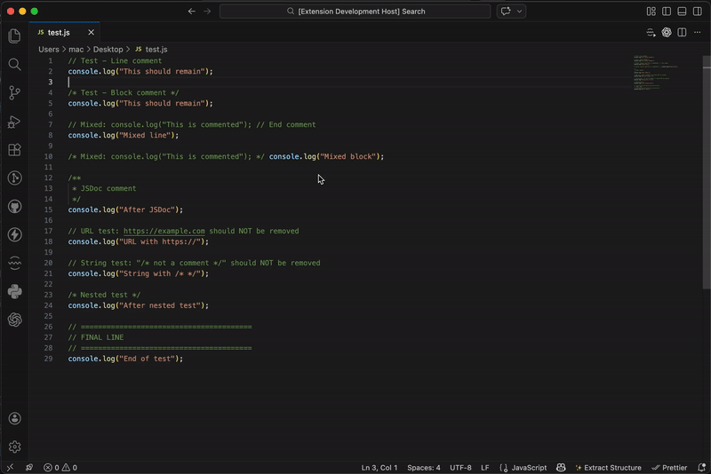

# Remove Comments

[](https://marketplace.visualstudio.com/items?itemName=your-publisher-name.remove-comments)
[](https://marketplace.visualstudio.com/items?itemName=your-publisher-name.remove-comments)
[](LICENSE)

A powerful VS Code extension to remove comments from your code files. Supports **30+ programming languages** with three flexible comment removal options.



## Features

### Three comment removal options

| Command | Description | Shortcut (Mac) | Shortcut (Win/Linux) |
|---------|-------------|----------------|---------------------|
| **Remove all comments** | Deletes both line and block comments | `Cmd+Shift+K` | `Ctrl+Shift+K` |
| **Remove line comments** | Deletes only line comments (//, #, etc.) | `Cmd+Shift+L` | `Ctrl+Shift+L` |
| **Remove block comments** | Deletes only block comments (/* */, <!-- -->, etc.) | `Cmd+Shift+B` | `Ctrl+Shift+B` |

### Multi-Language Support

<details>
<summary>Click to see all supported languages (30+)</summary>

#### Web Languages
- JavaScript (.js, .jsx)
- TypeScript (.ts, .tsx)
- HTML (.html)
- CSS (.css)
- SCSS (.scss)
- Less (.less)
- XML (.xml)

#### Backend Languages
- Java (.java)
- C (.c)
- C++ (.cpp)
- C# (.cs)
- Python (.py)
- Ruby (.rb)
- PHP (.php)
- Go (.go)
- Rust (.rs)
- Swift (.swift)
- Kotlin (.kt)
- Scala (.scala)
- Dart (.dart)

#### Scripting & Config
- Bash/Shell (.sh, .bash)
- PowerShell (.ps1)
- Perl (.pl)
- SQL (.sql)
- YAML (.yml, .yaml)
- TOML (.toml)
- INI (.ini)

#### And more
- The extension also works with many other languages through its intelligent fallback system
</details>

### Demo


*Demo shows: Removing all comments, then only line comments, then only block comments from a JavaScript file*

## Installation

### Method 1: From VS Code Marketplace (Coming Soon)
1. Open VS Code
2. Go to Extensions (`Cmd+Shift+X` on Mac, `Ctrl+Shift+X` on Win/Linux)
3. Search for "Remove Comments"
4. Click Install

### Method 2: Manual Installation (VSIX)
```bash
# Package the extension
npm install -g vsce
vsce package

# Install the generated .vsix file
code --install-extension remove-comments-0.0.1.vsix